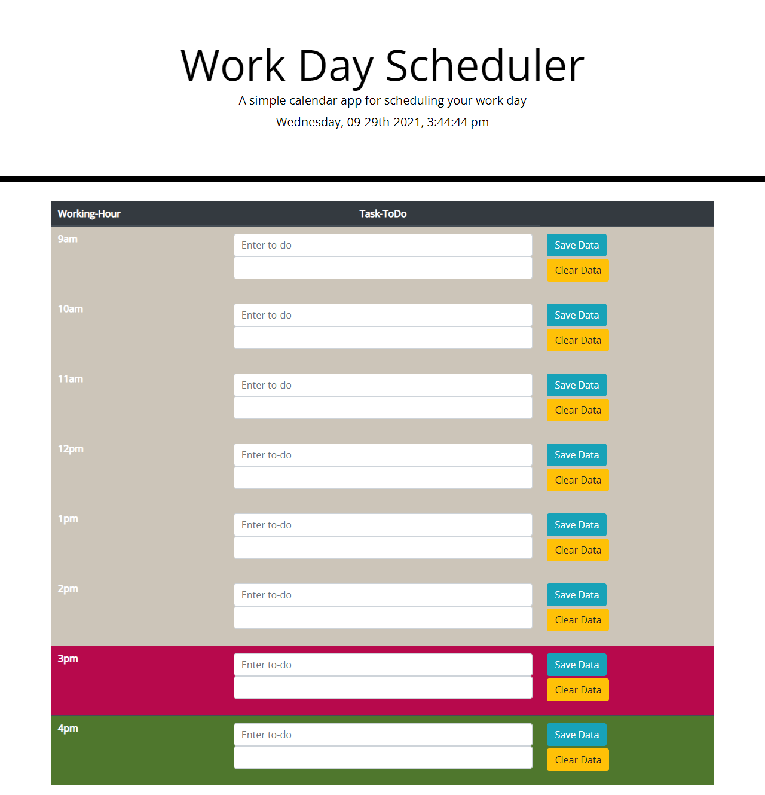

# Day-Scheduler

**User Story**

AS AN employee with a busy schedule 
I WANT  :  A simple calendar application that allows me to save events for each hour 
           of the day to a daily planner. 
SO THAT :  I can manage my time effectively.

**Acceptance Criteria**

**(1)*WHEN I open the planner, then the current day and time is displayed at the top of the calendar**
------
It's considered done 
------
WHEN : #currentDay id is used to grab the element. 
WHEN : moment() method is applied to get the date. 
WHEN : setInterval() is used to display current time.

**(2)*WHEN I scroll down, then I am presented with timeblocks for standard business hours**
------
It's considered done 
------
WHEN : html code (from getbootstrap) is provided in index.html to present a table 
       format. 
WHEN : class = "table table-hover table-dark table-striped" (bootstrap classes )is 
       providedto "table" element for styling. 
WHEN : inside the "thead", "th" is named as "working-hour" & "task-ToDo". 
WHEN : some more table row "tr" is added in the code considering 8 hours of work. 
WHEN : each table head "th" is given different time of working hour.

**(3)*WHEN I view the timeblocks for that day, then each timeblock is color coded to indicate whether it is in the past, present, or future**
------
It's considered done 
------
WHEN : every table row element "tr" is given same class (class="eachRow"). 
WHEN : each "tr" is grabbed by using this class and stored in a variable "rowsArr". 
WHEN : a for-loop is applied on this variable to apply different color for different 
       hour of the day by comparing the time on each "th" to the current time. 
WHEN : a function is written to set the color on each element and passed to the 
       for-loop.

**(4)*WHEN I click into a timeblock then I can enter an event**
------
It's considered done 
------
WHEN : an input element "input" with type text is created inside each table data "td" 
       element with class name. 
WHEN : a paragraph "p" element si created inside each "td".

**(5)*WHEN I click the save button for that timeblock, then the text for that event is saved in local storage**
------
It's considered done 
------
WHEN : two button element are created inside every "tr". One to save the data & other 
       to clear the stored data. 
WHEN : every text-box is given a class name and each one of them is grabbed using 
       their calss and stored in a variable. 
WHEN : every "p" tag is given a class name and each one of them is grabbed using 
       their calss and stored in a variable. 
WHEN : every save "button" is given a class name and each one of them is grabbed using 
       their calss and stored in a variable. 
WHEN : every clear "button" is given a class name and each one of them is grabbed 
       using their calss and stored in a variable. 
WHEN : a local storage is created for text entered in every "input" type and stored in 
       a variable. 
WHEN : eventListener is added to every text box input to get its value. 
WHEN : a function "saveToLocalStorage" is written to save input value in 
       a localStorage for all input text box. 
WHEN : an eventListener is added to all the save buttons to run the 
       save-to-local-storage function. 
WHEN : an eventListener is added to all the clear buttons to clear the saved text from 
       their respective local storage.

------
Deployed application should look like the below given image. 
------

------
Deployed application screenshot 
------
